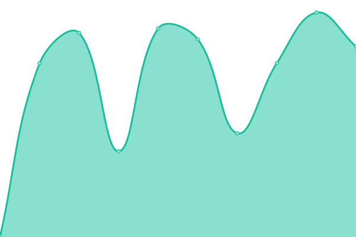
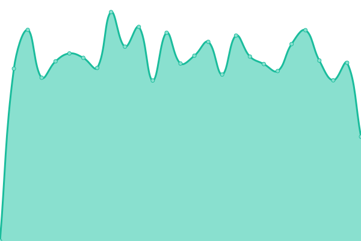

# [📈 Live Status](https://status.easybits.cn): <!--live status--> **🟧 Partial outage**

This repository contains the open-source uptime monitor and status page for [Meland.ai](https://www.icodeworld.cn), powered by [Upptime](https://github.com/upptime/upptime).

With [Upptime](https://upptime.js.org), you can get your own unlimited and free uptime monitor and status page, powered entirely by a GitHub repository. We use [Issues](https://github.com/ICodeWorld-Inc/status-pages/issues) as incident reports, [Actions](https://github.com/ICodeWorld-Inc/status-pages/actions) as uptime monitors, and [Pages](https://status.easybits.cn) for the status page.

<!--start: status pages-->
<!-- This summary is generated by Upptime (https://github.com/upptime/upptime) -->
<!-- Do not edit this manually, your changes will be overwritten -->
<!-- prettier-ignore -->
| URL | Status | History | Response Time | Uptime |
| --- | ------ | ------- | ------------- | ------ |
|  [web-runtime](https://web-runtime-release.melandworld.com/) | 🟩 Up | [web-runtime.yml](https://github.com/Meland-Inc/status-pages/commits/HEAD/history/web-runtime.yml) | 

 798ms
     
 | 

<a href="https://status.melandworld.com/history/web-runtime">97.52%</a>
    

|  [web-site](https://meland.ai/) | 🟩 Up | [web-site.yml](https://github.com/Meland-Inc/status-pages/commits/HEAD/history/web-site.yml) | 

 493ms
     
 | 

<a href="https://status.melandworld.com/history/web-site">100.00%</a>
    

|  [www-web-site](https://www.meland.ai/) | 🟩 Up | [www-web-site.yml](https://github.com/Meland-Inc/status-pages/commits/HEAD/history/www-web-site.yml) | 

 309ms
     
 | 

<a href="https://status.melandworld.com/history/www-web-site">100.00%</a>
    

|  [polygon-rpc-syning](https://status-pages.vercel.app/api/polygon-rpc-syncing) | 🟥 Down | [polygon-rpc-syning.yml](https://github.com/Meland-Inc/status-pages/commits/HEAD/history/polygon-rpc-syning.yml) | 

 1804ms
     
 | 

<a href="https://status.melandworld.com/history/polygon-rpc-syning">97.88%</a>
    

<!--end: status pages-->

[**Visit our status website →**](https://status.melandworld.com)

## 📄 License

- Powered by: [Upptime](https://github.com/upptime/upptime)
- Code: [MIT](./LICENSE) © [Meland.ai](https://www.icodeworld.cn)
- Data in the `./history` directory: [Open Database License](https://opendatacommons.org/licenses/odbl/1-0/)
